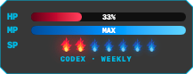

# Codex Pet HUD

Codex Pet HUD is a macOS 14 companion for one selected Codex v2 pet. It keeps a
compact tactical dual-bar HUD above the pet, including when Codex has no active
task. HP shows weekly quota remaining; seven SP flames show reset progress.



| Panic preview | Tracked Yicha critical body asset |
| --- | --- |
|  |  |

The critical image is the current prone integrated-eye Yicha body asset, not a
live HUD screenshot. The tracked critical asset intentionally omits runtime orbit glyphs.
At runtime `PetEffectView` adds two `🐦` birds and two `✨` sparkles around the calibrated head anchor in the separate pet-replacement window.
Live panic and critical screenshots will be recaptured before release.

## Tactical HUD

Snapshots whose age is `≤300s` are fresh and show the raw weekly HP percentage,
using one decimal only for non-integral values. Bands are `>90%` emerald,
`51–90%` green, `10–50%` amber, `4–9%`
red, and `≤3%` bright red. At an age of `>300s` and `≤1800s`, the last values
remain with `STALE` and never drive effects.
At an age of `>1800s`, the HUD is `OFFLINE` with `--` values.

SP always has seven rounded three-layer flames. Lit flames are
red/orange/yellow; unlit flames are blue/cyan/ice-blue. Each flame represents
one elapsed seventh of the weekly reset window, from zero lit at a new window to
seven at reset.

Fresh `4–9%` HP replaces the pet with a compact panic run. The critical
threshold is fixed at `≤3%`; critical replaces the pet and clears only above
`5%`. Critical includes the contained bird/sparkle orbit around the manifest
head anchor. These are pet-state replacements, not HUD content.

- Generic fallback: standard directional running frames, non-facial aura, no procedural eye overlay.
- Custom strip: integrated eye art inside the sprite pixels.

Missing or invalid effect assets fall back without hiding the tactical HUD.

## Idle Presence and Alignment

Exact mascot observations refresh pet geometry. Stable Codex companion windows
keep the HUD present while the task is idle. Title-redacted presence requires one
complete same-PID companion cluster and fails closed when multiple complete
clusters exist. The local geometry cache retains only high-confidence
shell-derived bounds, PID, window ID, and timestamp; mascot fallback geometry is
transient. Cached geometry restores only for matching stable presence on a
connected display. Both panels hide only after three missing observations
spanning at least two seconds.

The HUD centers above the pet. `podScale`, `podOffsetX`, and `podOffsetY`
remain compatible; `podScale` is clamped to `0.65...1.6`. Positive X moves
right and positive Y moves up.

## Install From Source

```bash
git clone https://github.com/PhDhang/codex-pet-hud.git
cd codex-pet-hud
swift test --disable-sandbox
scripts/build-app.sh
scripts/install.sh --pet-path "$HOME/.codex/pets/YOUR_PET"
```

Run a redacted diagnostic check:

```bash
"$HOME/Applications/Codex Pet HUD.app/Contents/MacOS/CodexPetHUD" --diagnose
```

The installer writes private configuration and a per-user LaunchAgent. Settings
live at `$HOME/.config/codex-pet-hud/config.json`; refresh is at least five
minutes and X/Y offsets are `-300...300`. The legacy
`criticalThresholdPercent` setting is retained for compatibility, but tactical
critical behavior remains fixed at `≤3%` enter and above `5%` recovery.

## Optional Per-Pet Effects

Generic v2 fallback effects need no extra files. An optional custom panic strip
carries integrated eye art and may omit legacy eye anchors. Yicha ships `hud-panic.png`
with eight right-running frames; the runtime mirrors that strip for left travel.
Copy its checked effect assets and manifest into the selected Yicha directory:

```bash
test -d "$HOME/.codex/pets/yicha"
test -f Examples/yicha/hud-panic.png
test -f Examples/yicha/hud-critical.png
test -f Examples/yicha/hud-effects.json
cp -n Examples/yicha/hud-panic.png "$HOME/.codex/pets/yicha/hud-panic.png" ||
  test -e "$HOME/.codex/pets/yicha/hud-panic.png"
cp -n Examples/yicha/hud-critical.png "$HOME/.codex/pets/yicha/hud-critical.png" ||
  test -e "$HOME/.codex/pets/yicha/hud-critical.png"
cp -n Examples/yicha/hud-effects.json "$HOME/.codex/pets/yicha/hud-effects.json" ||
  test -e "$HOME/.codex/pets/yicha/hud-effects.json"
cmp -s Examples/yicha/hud-panic.png "$HOME/.codex/pets/yicha/hud-panic.png" ||
  { printf 'Existing hud-panic.png differs; left unchanged.\n' >&2; exit 1; }
cmp -s Examples/yicha/hud-critical.png "$HOME/.codex/pets/yicha/hud-critical.png" ||
  { printf 'Existing hud-critical.png differs; left unchanged.\n' >&2; exit 1; }
cmp -s Examples/yicha/hud-effects.json "$HOME/.codex/pets/yicha/hud-effects.json" ||
  { printf 'Existing hud-effects.json differs; left unchanged.\n' >&2; exit 1; }
```

`hud-effects.json` may reference only regular image files relative to the pet
directory. The repository fixture validates the Yicha panic strip as eight
`192x208` RGBA cells with clean alpha and connected artwork. `cp -n` refuses to
overwrite installed assets; `cmp -s` detects a different pre-existing file and
leaves it untouched. The app validates relative paths, containment, and readable
assets at load time. Use `hatch-pet` for custom panic or critical art; do not
modify the original spritesheet.

## Skill, Uninstall, and Privacy

Copy `skills/codex-pet-hud` into the Codex skills directory. To use a fork:

```bash
export CODEX_PET_HUD_REPO_URL="https://github.com/PhDhang/codex-pet-hud.git"
```

Keep configuration while uninstalling:

```bash
scripts/uninstall.sh
```

Without `--purge`, configuration, caches, and logs remain.

Remove the app, LaunchAgent, logs, and settings:

```bash
scripts/uninstall.sh --purge
```

`--purge` also removes the quota snapshot and geometry cache from
`Library/Application Support/CodexPetHUD`.

The app makes one read-only quota request and never logs credentials, account
IDs, emails, cookies, or raw provider responses. It uses public window metadata
only and requests neither Accessibility nor Screen Recording. See
`docs/privacy.md` for the full boundary and release scan command.

## Development

```bash
swift test --disable-sandbox
for test_script in Tests/Shell/*.bats; do
  bash "$test_script"
done
```

See `docs/architecture.md` for component boundaries and data flow.

## Status

Version 0.3.0-rc.1 targets macOS 14 and newer. This is an independent community
project, not an official OpenAI product. Quota and window metadata can change.

## License

MIT
