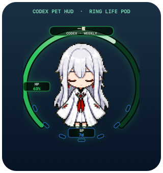
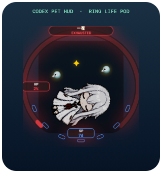

# Codex Pet HUD

Codex Pet HUD is a native macOS companion for Codex v2 pets. It follows the
live pet window and renders a proportional ring life pod with weekly quota
and reset-cycle status.



## Features

- **HP ring:** shows remaining weekly Codex quota as a colored outer arc and
  numeric percentage.
- **Quota colors:** emerald above 90%, amber through the middle range, and red
  below 10%.
- **SP cells:** seven lower-arc cells visualize progress toward the weekly reset. Seven
  days remaining starts empty; two days remaining lights five cells.
- **Critical state:** at 3% remaining or less, a darkened pet clone, stars, and
  circling birds indicate an exhausted character.
- **Live attachment:** tracks the exact `Codex Pet Mascot Effect` window and
  follows moves, resizes, and temporary window reconstruction.
- **Proportional layout:** scales from the current pet dimensions and supports
  independent scale and X/Y alignment adjustments.
- **Local-first:** reads Codex authentication locally, sends one read-only
  quota request, and never reads browser cookies.
- **Reusable Skill:** includes a Codex Skill for prerequisite checks, source
  installation, diagnostics, repair, and removal.

### Critical State

| Exhausted life pod | Downed pet effect |
| --- | --- |
|  |  |

## Requirements

- macOS 14 or newer
- Codex desktop with a visible v2 pet
- Swift 6.2 or newer from Xcode Command Line Tools
- A signed-in Codex session

## Install From Source

```bash
git clone https://github.com/PhDhang/codex-pet-hud.git
cd codex-pet-hud
swift test --disable-sandbox
scripts/build-app.sh
scripts/install.sh --pet-path "$HOME/.codex/pets/YOUR_PET"
```

The installer copies the application to
`$HOME/Applications/Codex Pet HUD.app`, writes a private configuration file,
and installs a per-user LaunchAgent.

Run a redacted health check:

```bash
"$HOME/Applications/Codex Pet HUD.app/Contents/MacOS/CodexPetHUD" --diagnose
```

## Configuration

Settings live at `$HOME/.config/codex-pet-hud/config.json`:

```json
{
  "petPath": "~/.codex/pets/YOUR_PET",
  "refreshIntervalSeconds": 300,
  "criticalThresholdPercent": 3,
  "podScale": 1.14,
  "podOffsetX": 0,
  "podOffsetY": 0,
  "launchAtLogin": true
}
```

Refresh intervals shorter than five minutes are clamped. Critical thresholds
are limited to 0–10%. `podScale` is relative to the current pet size and is
limited to `1.0...1.8`; `podOffsetX` and `podOffsetY` move the ring by up to
±300 points without resizing the pet. Positive X moves right and positive Y
moves up. Try `1.10` for a close ring, `1.14` for the default, or `1.22` for
more breathing room.

Existing configuration files continue working when these keys are absent.
The legacy `nameplateOffset` key remains accepted but does not move the ring.

## Install The Skill

Copy `skills/codex-pet-hud` into your Codex skills directory. The Skill can
check prerequisites and install from this repository. To use a fork instead,
set:

```bash
export CODEX_PET_HUD_REPO_URL="https://github.com/PhDhang/codex-pet-hud.git"
```

Then ask Codex to install or diagnose Codex Pet HUD for a v2 pet.

## Uninstall

Keep configuration:

```bash
scripts/uninstall.sh
```

Remove the app, LaunchAgent, logs, and configuration:

```bash
scripts/uninstall.sh --purge
```

## Development

```bash
swift test --disable-sandbox
for test_script in Tests/Shell/*.bats; do
  bash "$test_script"
done
```

See `docs/architecture.md` for component boundaries and `docs/privacy.md` for
the data-flow and credential policy.

## Status

Version 0.2.0 targets macOS only. This is an independent community project,
not an official OpenAI product. The quota endpoint and Codex pet window title
are implementation details that may change.

## License

MIT
